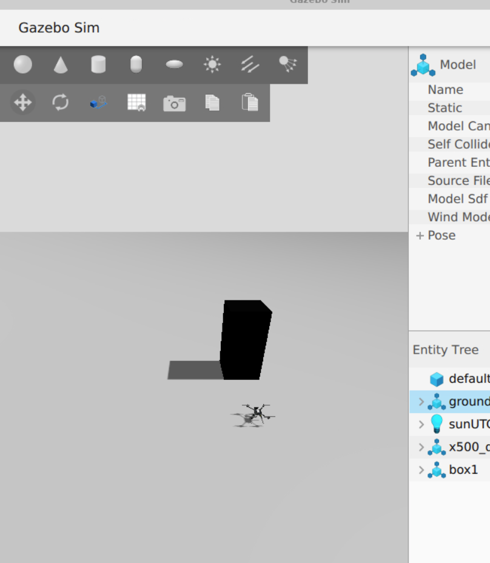
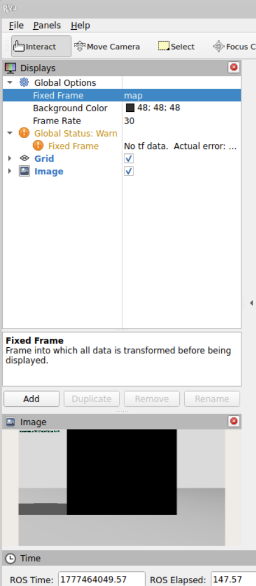
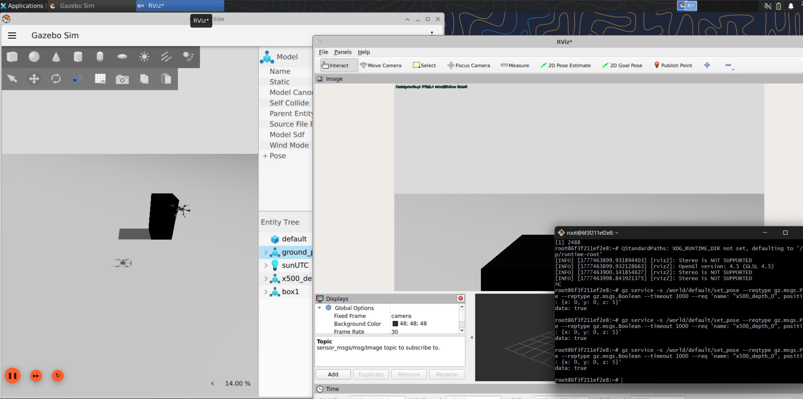

# Autonomous Perception with ROS2 & YOLOv8

**DevOps for Cyber-Physical Systems, HS 2026 — Exercise 08: Perception**

**ROS2 Version:** Jazzy Jalisco  

## Repository
[https://github.com/edwardhaynes1/autonomous-perception-ros2](https://github.com/edwardhaynes1/autonomous-perception-ros2)

---

## What's included

| Package | Description |
|---------|-------------|
| `perception_interfaces` | Custom messages: `Detection2D`, `Detection2DArray` |
| `yolo_detector` | Task 1 — YOLOv8 real-time detection + annotated image publisher |
| `depth_estimator` | Task 2 — Depth estimation, point cloud, RANSAC ground segmentation |

---

## Simulation Environment

Gazebo Harmonic simulation with PX4 SITL x500 depth drone:



---

## Task 1: Object Detection with YOLO

YOLOv8n model running in real-time on the drone's RGB camera stream, publishing annotated images with bounding boxes overlaid:




### Demo Video

https://github.com/edwardhaynes1/autonomous-perception-ros2/blob/main/docs/demo_video.mp4

### Custom Message: `Detection2DArray`

```
std_msgs/Header header
int32 image_width
int32 image_height
perception_interfaces/Detection2D[] detections
float32 inference_time_ms
float32 total_time_ms
float32 fps
```

### Custom Message: `Detection2D`

```
std_msgs/Header header
string class_name
int32 class_id
float32 confidence
int32 x_min
int32 y_min
int32 x_max
int32 y_max
float32 cx
float32 cy
```

### Performance Analysis (CPU inference, yolov8n)

| Metric | Value |
|--------|-------|
| Mean inference time | ~180 ms |
| p95 inference time | ~204 ms |
| Throughput | ~3.8 FPS |
| Device | CPU (no GPU) |
| Model | YOLOv8n (3.2M params) |

---

## Task 2: Depth Estimation and 3D Point Cloud

ROS2 node subscribing to RGB + depth topics, generating coloured point clouds and performing RANSAC ground plane segmentation. Publishes three topics:

| Topic | Description |
|-------|-------------|
| `/perception/points_raw` | Full coloured point cloud |
| `/perception/points_ground` | Ground plane points (green) |
| `/perception/points_obs` | Obstacle points only (red) — for downstream use |

---

## Setup

### 1. Clone the simulation environment
```bash
git clone https://github.com/erdemuysalx/px4-sim.git
cd px4-sim
git clone https://github.com/edwardhaynes1/autonomous-perception-ros2.git perception_ws
```

### 2. Build Docker image
```bash
sed -i 's/\r//' px4_entrypoint.sh ros_entrypoint.sh
./build.sh --all
docker-compose up -d
```

### 3. Install Python dependencies (first time only)
```bash
docker exec -it px4_sitl bash
pip3 install --break-system-packages "setuptools<70" "numpy<2" ultralytics opencv-python-headless
```

### 4. Build the ROS2 workspace
```bash
cd /root/perception_ws
source /opt/ros/jazzy/setup.bash
colcon build --symlink-install
source install/setup.bash
```

### 5. Launch PX4 SITL + Gazebo
```bash
cd /root/PX4-Autopilot && make px4_sitl gz_x500_depth
```

### 6. Launch perception nodes
```bash
source /opt/ros/jazzy/setup.bash
source /root/perception_ws/install/setup.bash
ros2 launch yolo_detector perception_launch.py
```

### 7. Visualise in RViz2
```bash
rviz2
```
Add display → By topic → `/perception/annotated_image` → Image

---

## Verify topics
```bash
ros2 topic list
ros2 topic hz /perception/detections
ros2 topic echo /perception/detections
```

---

## Tools
Docker · ROS2 Jazzy · Gazebo Harmonic · PX4 SITL · YOLOv8 · OpenCV · NumPy · RViz2
